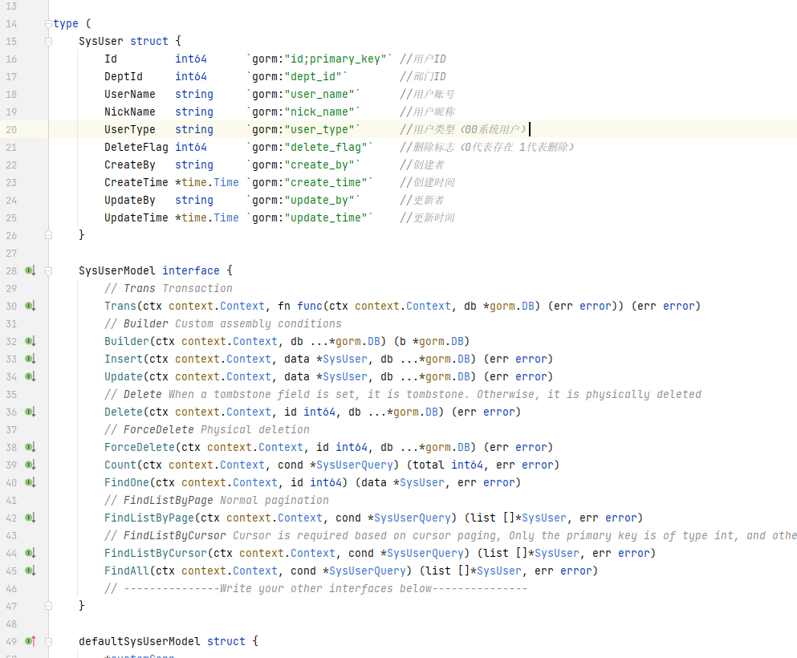

# generatecode
根据sql语句快速生成protobuf、api等文件, 会根据表字段约束自动设置tag里面的default、range、optional; 当Switch选择B时生成的代码文件会根据表分目录

# 1.安装
```shell
go install github.com/maolinc/gencode@latest
```

# 2.运行
```shell
gencode -f="genConfig.json" 
```
-f 指定配置文件路径

# 部分生成的代码


# genConfig.json解释
```js
{
  "DBConfig": { //数据库配置
    "DbType": "mysql", //数据库类型
    "DBName": "koala", //数据库名字
    "Host": "127.0.0.1", //数据库地址
    "Port": 3306, //数据库端口
    "User": "root", //数据库用户名
    "Password": "123456" //数据库密码
  },
  "GlobalConfig": { //全局配置
    "FieldStyle": "", //字段风格,可选：mLc | m_lc,默认：mLc  效果mLc:`json:createTime` m_lc:`json:create_time`
    "ServiceName": "", //服务名称,默认为数据库名字, 影响proto、api文件名字
    "Tables": [], //可指定代生成的表, 默认全部表   eg:["sys_role", "sys_user"]
    "IgnoreTables": [], //需要忽略的表  eg:["sys_post"]
    "IgnoreFields": [], //忽略字段  eg:["delete_flag", "update_time"]
    "IgnoreMap": {} //可指定某表中忽略某些字段,  eg:{"sys_role":["delete_flag","create_time"], "sys_user":["password"]}
  },
  "ApiConfig": { //api文件生成配置, 替换GlobalConfig中重复字段
    "Switch": "A", //开关选择, A:只生成api文件, B:生成api文件并执行goctl api命令,  不填则不会生成api文件
    "GoZeroStyle": "", //指定goctl命令中的style
    "DateStyle": "", //控制日期类型格式, 可选：string、number, 默认number对于的日期格式为int64
    "ServiceName": "", //服务名字, 默认为GlobalConfig中ServiceName
    "Syntax": "", //api文件的syntax
    "Prefix": "", //api文件的接口前缀, 默认数据库名称
    "Author": "", //api文件的author
    "Email": "", //api文件的email
    "Version": "", //api文件的version
    "OutPath": "", //指定api文件生成输出路径, 默认会在当前路径生成api文件夹
    "IgnoreFieldValue": {} //控制字段在创建、更新、查询时是否显示, 具体规则见下面
  },
  "ProtoConfig":{  //proto文件生成配置, 替换GlobalConfig中重复字段
    "Switch": "A", //开关选择, A:只生成proto文件, B:生成proto文件并执行goctl rpc命令,  不填则不会生成proto文件
    "GoZeroStyle": "", //指定goctl命令中的style
    "DateStyle": "", //控制日期类型格式, 可选：string、number, 默认number对于的日期格式为int64
    "ServiceName": "", //服务名字, 默认为GlobalConfig中ServiceName
    "Syntax": "", //proto文件的syntax
    "GoPackage": "", //proto文件的go_package
    "Package": "", //proto文件的package
    "OutPath": "", //指定proto文件生成输出路径, 默认会在当前路径生成rpc文件夹
    "IgnoreFieldValue": {} //控制字段在创建、更新、查询时是否显示, 具体规则见下面
  }
}
```

# 最简配置
```json
{
  "DBConfig": {
    "DbType": "mysql",
    "DBName": "koala",
    "Host": "127.0.0.1",
    "Port": 3306,
    "User": "root",
    "Password": "123456"
  },
  "ApiConfig": {
    "Switch": "A"
  },
  "ProtoConfig": {
    "Switch": "A"
  }
}
```

# 去注释全配置
```json
{
  "DBConfig": {
    "DbType": "mysql",
    "DBName": "koala",
    "Host": "127.0.0.1",
    "Port": 3306,
    "User": "root",
    "Password": "123456"
  },
  "GlobalConfig": {
    "FieldStyle": "",
    "ServiceName": "",
    "Tables": [],
    "IgnoreTables": [],
    "IgnoreFields": [],
    "IgnoreMap": {}
  },
  "ApiConfig": {
    "Switch": "A",
    "ServiceName": "",
    "GoZeroStyle": "",
    "DateStyle": "",
    "Syntax": "",
    "Prefix": "",
    "Author": "",
    "Email": "",
    "Version": "",
    "OutPath": "",
    "IgnoreFieldValue": {}
  },
  "ProtoConfig": {
    "Switch": "A",
    "ServiceName": "",
    "GoZeroStyle": "",
    "DateStyle": "",
    "Syntax": "",
    "GoPackage": "",
    "Package": "",
    "OutPath": "",
    "IgnoreFieldValue": {}
  }
}
```

# IgnoreFieldValue
```shell
IgnoreFieldValue: 类型字典{K:V}结构,K-string,V-int, 可以灵活控制字段在创建、更新、查询时是否显示
K对应字段, V对应字段值
默认值：{"create_time": 3, "create_at": 3, "update_time": 3, "update_by": 3, "delete_flag": 7, "del_flag": 7, "create_by": 3}
V显示规则: 1(create), 2(update),4(select),8(delete), 1+2=3(create,update)
          1+2+4=7(create,select,update)
根据1、2、4、8进行组合就行

举个例子: 
对于sys_user表, 结构看下面的sql
如果不想delete_flag字段在创建、查询、更新的结构体存在, 可写 {"delete_flag":7}
如果不想create_time和update_time字段在创建、更新的结构体存在, 可写 {"create_time":3, "update_time":3}
如果不想password字段在查询的结构体存在, 可写 {"password":4}

这么做的原因是借助二进制进行控制
// false->ignore  true->show  eg:2 & 7 = 010 & 111 = 010= 2==0=false ignore
```
```sql
  `id` bigint(20) NOT NULL AUTO_INCREMENT COMMENT '用户ID',
  `password` varchar(100) DEFAULT '' COMMENT '密码',
  `delete_flag` int(11) DEFAULT '0' COMMENT '删除标志（0代表存在 1代表删除）',
  `login_ip` varchar(128) DEFAULT '' COMMENT '最后登录IP',
  `login_date` datetime DEFAULT NULL COMMENT '最后登录时间',
  `create_by` varchar(64) DEFAULT '' COMMENT '创建者',
  `create_time` datetime DEFAULT NULL COMMENT '创建时间',
  `update_by` varchar(64) DEFAULT '' COMMENT '更新者',
  `update_time` datetime DEFAULT NULL COMMENT '更新时间',
  `salt` varchar(128) NOT NULL COMMENT '加密盐',
```


# 其他
1. 查询sql部分参考了https://github.com/Mikaelemmmm/sql2pb
